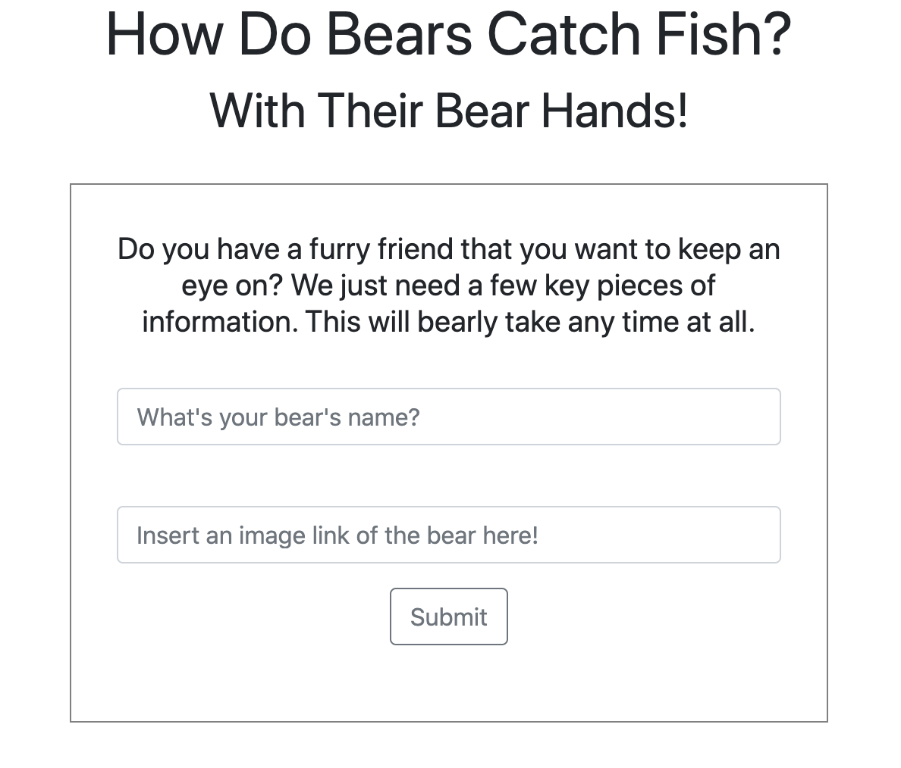
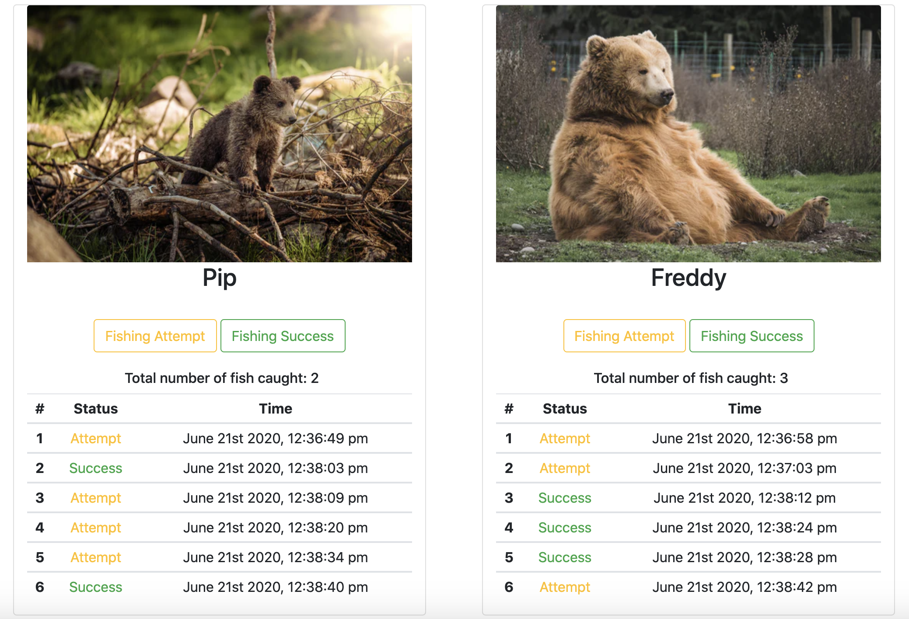

# Bear Watcher Exercise

## Description
This is a homework assignment to practice using ES6 modules. It is styled with Bootstrap.

### Feature List
* Contains a form where a user can enter a bear's name and image to then see it printed on the page after hitting the submit button
* The bear cards display two buttons which the user can click to track the bear's fishing attempts or successes
* The data is then logged in a table and displayed on the bear's card
* Users can observe each bear's attempts, successes, and the sum of all successes, displayed as the total number of fish caught.

### How To Run
1. Clone the repo to have it on your local machine
1. Use `hs` to start up a local server
1. Visit the server in your browser (defaults to localhost:8080)

### Screenshots

### Contributors
* [Jeanine Beckle](https://github.com/jeaninebeckle)

### TODO
* Hide the table header on the card when it is first created, so that it is only visible for the individual bear after a success or attempt button has been clicked.
