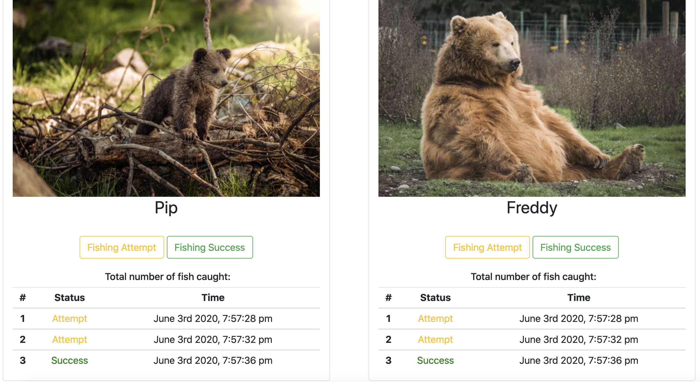

# Bear Watcher Exercise

## Description
This is a homework assignment to practice using ES6 modules. It is styled with Bootstrap.

### Feature List
* Contains a form where a user can enter a bear's name and image to then see it printed on the page after hitting the submit button
* The bear cards display two buttons which the user can click to track the bear's fishing attempts or successes
* The data is then logged in a table and displayed on the bear's card

### How To Run
1. Clone the repo to have it on your local machine
1. Use `hs` to start up a local server
1. Visit the server in your browser (defaults to localhost:8080)

### Screenshots

### Contributors
* [Jeanine Beckle](https://github.com/jeaninebeckle)

### TODO
* Fix code so that the fishing buttons work properly. Right now any one button changes the table on every bear card so that they all display identical data. The table also does not refresh until a new bear is created.
* Hide the table header on the card when it is first created, so that it is only visible after a success or attempt button has been clicked.
* Display on the bear card a total number of fish caught based on the number of times the success button was clicked.
